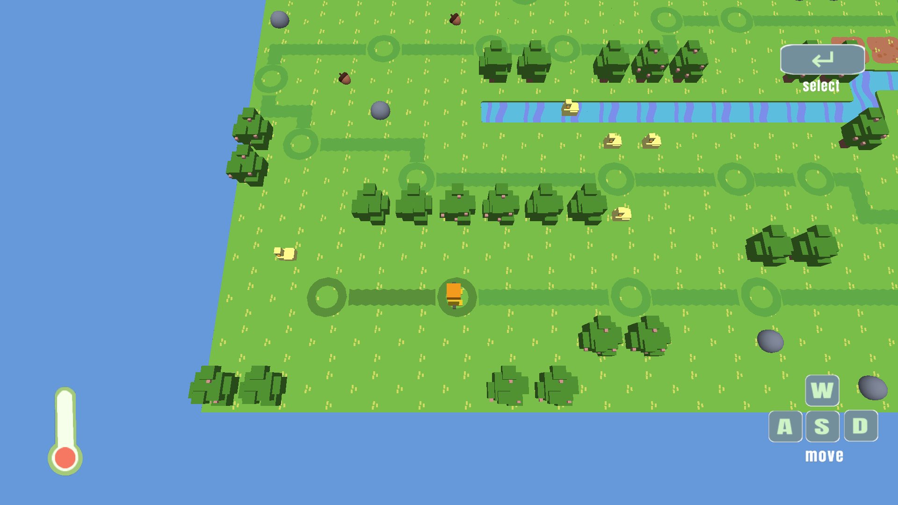

# Enviro

A puzzle game about hazardous waste disposal. Created for CMU's Computer Game Programming (Fall, 2020).




## Created By:
* Jianrong Yu
* Alyssa Lee
* Michelle Chang
* Dominic Calkosz


### Special Thanks To:
* Jim McCann
* Xiaoqiao Xu
* All of our playtesters!


## Sources:
This game was built with [NEST](NEST.md).

"Deep Relaxation" Kevin MacLeod (incompetech.com)
Licensed under Creative Commons: By Attribution 4.0 License
http://creativecommons.org/licenses/by/4.0/

Additional audio provided by https://freesound.org/


## Command line arguments
Enviro is fullscreen by default, except for Linux, which is windowed by default. Use either of these args to override this:
```
    --windowed
    --fullscreen
```
